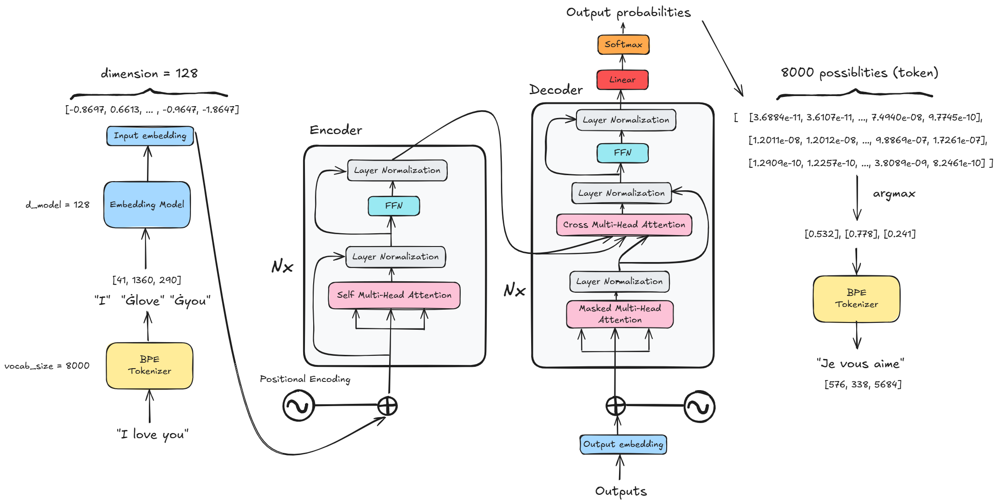

# Transformer from Scratch

## Overview
This project serves as learning purpose and building transformer from scratch using PyTorch. An encoder-decoder Transformer is implemented for English-to-French translation.

## Architecture

*Figure 1: High-level Transformer architecture*

Figure 1 shows the high-level Transformer architecture implemented in this project. It demonstrates the end-to-end process of translating a sentence, starting with tokenization, converting tokens into embeddings, and processing them through encoder and decoder. The decoder then projects its hidden representations into vocabulary space and applies a softmax function to generate probability distribution over all tokens in the vocabulary. The token with highest probabilities is selected and decoded by tokenizer to produce the translated sentence.

## Datasets
The model is trained on the OPUS Books dataset — a collection of translated texts from the web, aligned by Andras Farkas. For this project, the English-French language pair is used
to trian the Transformer for English-to-French translation. The dataset is available on [Hugging Face](https://huggingface.co/datasets/Helsinki-NLP/opus_books).

## Tokenization
Byte-Pair Encoding (BPE) tokenization is used to tokenize the inputs and it is used by a lot of Transformer models, include GPT, GPT-2 and etc. It works by repeatedly finding the most common pairs of characters in the text and combining them into a new subword until the vocabulary reaches a desired size. However, we not going to implement BPE tokenizer from scratch in this project, instead it uses the Hugging Face `tokenizers` framework to train a BPE tokenizer on the bilingual dataset. 

The tokenizer uses a vocabulary of size 8,000 and includes four special tokens: `<PAD>`, `<BOS>`, `<EOS>`, and `<UNK>`. The trained tokenizer is saved and is used to convert the source and target sentences into token IDs for transformer training and inferece.

## Transformer Components
The transformer is implemented using PyTorch without using a pretrained Transformer model.

The main components are:
- Token Embeddings: Converts token IDs into dense vector representations.
- Positional Encodings: Add positional informations to the token embeddings.
- Multi-Head Attention: Allows the model to capture diverse relationships and patterns in the input sequences.
- Encoder: Processes the input sequence and produces contextual representations.
- Decoder: Generates the target sequence using the encoder output and previously generated tokens.
- Output Projection: Maps decoder representations to vocabulary-sized logits.

### References
- [Attention Is All You Need](https://arxiv.org/abs/1706.03762) (Vaswani et al., 2017)
- [Byte-Pair Encoding (BPE) in NLP](https://www.geeksforgeeks.org/nlp/byte-pair-encoding-bpe-in-nlp/) (Geeksforgeeks, 2025)
- [Cracking the Annotated Transformer - Part I](https://drhuangxiao.com/Blogs/Cracking+the+Annotated+Transformer+-+Part+I) (Huang Xiao)
- [Parallel Data, Tools and Interfaces in OPUS](https://aclanthology.org/L12-1246/) (Tiedemann, LREC 2012)